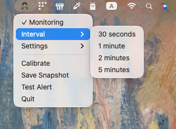
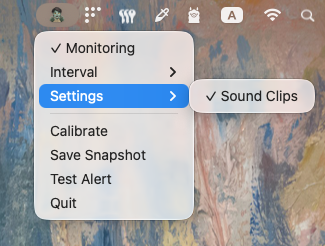
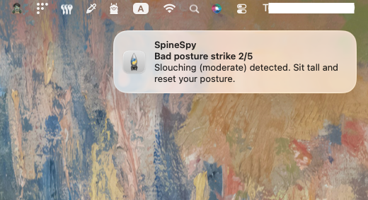

# SpineSpy

> AI-powered posture & focus monitor that runs in your macOS menubar. Takes periodic snapshots to detect bad posture and phone distractions without keeping your camera always on.

[](https://www.python.org/)
[](https://www.apple.com/macos/)

If you want tiny local-first tools for healthier desk work, starring helps me know this is worth polishing.

## Preview

<p>
  
  
  
</p>

<video src="assets/snippets/demo-spinespy.mov" controls width="720" title="SpineSpy voice clip demo"></video>

The [voice clip demo](assets/snippets/demo-spinespy.mov) shows how SpineSpy plays a posture reminder after repeated bad snapshots.

## Privacy

SpineSpy processes snapshots locally on your device. Images are not uploaded, stored, or sent to external servers.

## Features

- **Checks posture without a camera always-on feeling** - Opens the webcam briefly, analyzes a snapshot, then closes it
- **Learns your normal sitting position** - Calibrates against your own good-posture baseline instead of using a one-size-fits-all angle
- **Catches both slouching and leaning** - Flags forward slouching and side tilt with MediaPipe Pose
- **Nudges you when attention drifts** - Spots phone distractions with YOLO26s object detection
- **Smart alerts** - Shows a notification and plays a posture reminder clip after repeated bad posture
- **Easy to keep out of the way** - Runs from the macOS menubar with pause, interval, calibration, and sound toggles

## Setup

```bash
# Clone the repo
git clone https://github.com/jananadiw/spinespy.git
cd spinespy

# Install dependencies
poetry install
```

## Usage

```bash
# Option 1: Using the run script
./run.sh

# Option 2: Poetry script
poetry run start

# Option 3: Direct Python module
poetry run python menubar_app.py
```

The app appears as a 🦸 icon in your menubar. Right-click to:
- **✓ Monitoring** - Pause/resume monitoring
- **Interval** - Change snapshot frequency
- **Settings → Sound Clips** - Turn posture reminder clips on/off
- **Calibrate** - Capture your current good-posture baseline
- **Quit** - Exit the app

## How It Works

1. Every N minutes, the app briefly opens your camera and takes a snapshot
2. **MediaPipe Pose** analyzes the image for slouching or tilting relative to your calibrated baseline
3. **YOLO26s** checks for phones in the frame with improved small-object detection
4. Camera closes immediately after analysis
5. Menubar icon updates: 🦸 (good) or 🧟 (bad posture)
6. After 5 consecutive bad snapshots → shows a notification and plays a random reminder clip if sound clips are enabled

## Configuration

Edit these values in `menubar_app.py`:

```python
SLOUCH_THRESHOLD = 0.1   # forward lean sensitivity
TILT_THRESHOLD = 0.05    # side tilt sensitivity
BAD_STREAK_LIMIT = 5     # bad snapshots before alert
```

## Tech Stack

- **[OpenCV](https://opencv.org/)** - Camera snapshot capture
- **[MediaPipe](https://google.github.io/mediapipe/)** - Real-time pose estimation
- **[YOLO26s](https://github.com/ultralytics/ultralytics)** (Ultralytics) - Object detection for phone spotting
- **[rumps](https://github.com/jaredks/rumps)** - macOS menubar application framework

## Requirements

- macOS (tested on macOS 10.15+)
- Python 3.10 through 3.13
- Webcam

## Contributing

Contributions are welcome! Please feel free to submit a Pull Request.

1. Fork the repository
2. Create your feature branch (`git checkout -b feature/AmazingFeature`)
3. Commit your changes (`git commit -m 'Add some AmazingFeature'`)
4. Push to the branch (`git push origin feature/AmazingFeature`)
5. Open a Pull Request

## License

This project is licensed under the MIT License - see the [LICENSE](LICENSE) file for details.

## Acknowledgments

- MediaPipe for their excellent pose detection framework
- Ultralytics for YOLO26s
- The rumps library for making macOS menubar apps easy
